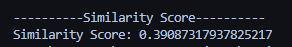

# Amazon Product Reviews Analyzer

## Description
The Amazon Product Reviews Analyzer is a Python program that performs sentiment analysis and review similarity on Amazon product reviews. It utilizes natural language processing techniques to provide insights into the sentiment of the reviews and to compare the similarity between two given reviews.

## Table of Contents
1. [Installation](#installation)
2. [Usage](#usage)
3. [Screenshots](#screenshots)
4. [Credits](#credits)

## Installation
To install the Amazon Product Reviews Analyzer locally, follow these steps:
1. Clone this repository to your local machine.
2. Make sure you have Python installed on your system. You can check by running python --version in your terminal.
3. Install the required libraries using pip:
pip install pandas / spacy / spacytextblob

## Usage
1. Download an Amazon product reviews dataset in CSV format (https://www.kaggle.com/datasets/datafiniti/consumer-reviews-of-amazon-products)
and name it `amazon_product_reviews.csv`. Ensure the dataset includes a column named "reviews.text" containing the review text. 
2. Run the script sentiment_analysis.py. This script performs the following:
•	Reads the reviews data from amazon_product_reviews.csv.
•	Preprocesses the reviews by tokenizing, lemmatizing, and removing stopwords and punctuation.
•	Analyzes the sentiment of a random sample of 5 reviews, including polarity, sentiment score, and sentiment label (positive, negative, or neutral).
•	Calculates the similarity score between two user-chosen reviews using the spaCy word vectors. 
3. The script will print the sentiment analysis results and the similarity score.

## Screenshots

*Figure 1: Sentiment Analysis Results*

*Figure 2: Similarity Score*

## Credits
- Created by Kamila Stenka
- Utilizes the following libraries:
  - [Pandas](https://pandas.pydata.org/): Used for data manipulation and analysis.
  - [spaCy](https://spacy.io/): Used for natural language processing tasks such as tokenization and similarity computation.
  - [spacytextblob](https://github.com/SauceCat/spacy-textblob): Used for sentiment analysis.
